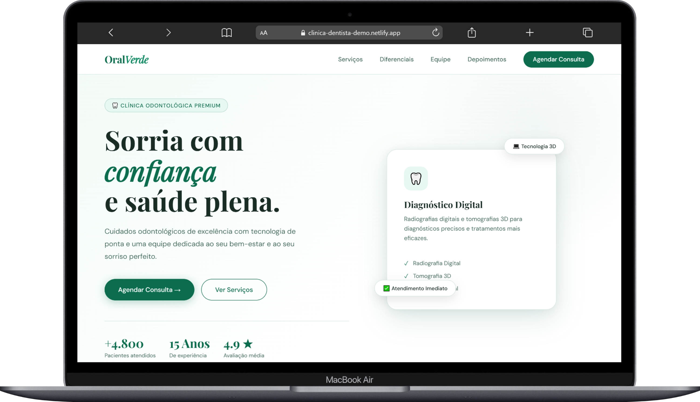

## 🦷 Clínica Odontológica - Landing Page

Landing page moderna e estratégica desenvolvida para clínicas odontológicas que desejam aumentar a captação de pacientes, fortalecer a presença digital e transmitir confiança desde o primeiro contato.

---

## 📌 Visão Geral

Este projeto consiste em uma landing page voltada para clínicas odontológicas, com foco em:

- Transmitir credibilidade e segurança
- Apresentar tratamentos de forma clara e objetiva
- Facilitar o agendamento de consultas
- Converter visitantes em pacientes

A interface foi projetada para ser limpa, profissional e orientada à ação.

---

## 🚀 Tecnologias Utilizadas

- HTML5 → Estrutura semântica e otimizada
- CSS3 → Design moderno, responsivo e agradável
- JavaScript → Interações e dinamismo

---

## 🎯 Objetivos do Projeto

- Gerar mais agendamentos online
- Melhorar a presença digital da clínica
- Apresentar serviços odontológicos com clareza
- Garantir experiência fluida em todos os dispositivos

---

## 🧠 Estrutura do Projeto

📁 clinica-odontologica-landing-page
 
 ├── 📁 assets
  
 │   ├── 📁 images
  
 │   └── 📁 icons
  
 ├── index.html
  
 ├── style.css
  
 └── script.js

 ---

## 📱 Responsividade

Desenvolvido com adaptação completa para:

- Smartphones
- Tablets
- Desktops

---

## ⚙️ Funcionalidades

- Menu responsivo
- Navegação suave entre seções
- Botão de agendamento rápido (WhatsApp ou formulário)
- Seções estratégicas:
    - Apresentação da clínica
    - Tratamentos odontológicos
    - Antes e depois (prova visual)
    - Depoimentos de pacientes
- Call-to-actions otimizados para conversão
- Estrutura básica de SEO

---

## 📸 Preview do Projeto

---

## 🔗 Deploy

Acesse o projeto online:

https://clinica-dentista-demo.netlify.app/

---

## 📈 Estratégia de Conversão

A landing page foi estruturada com foco em resultados:

- Headlines com foco em benefício (estética, saúde, confiança)
- Uso de prova social (depoimentos e resultados visuais)
- CTAs bem distribuídos ao longo da página
- Redução de fricção no agendamento
- Design limpo que transmite higiene e profissionalismo

---

## 💼 Aplicação Comercial

Este modelo pode ser utilizado por:

- Clínicas odontológicas
- Dentistas autônomos
- Clínicas de estética dental
- Consultórios especializados

---

## 🔧 Possíveis Melhorias Futuras

- Integração com sistema de agendamento online
- Formulário com envio automatizado
- Integração com CRM de pacientes
- Área de blog com conteúdos odontológicos
- Otimização avançada de SEO

---

## 👨‍💻 Autor

Desenvolvido por DevForge

Portfólio: https://devforgeweb.netlify.app/
 
Contato: https://wa.me/5585997013067